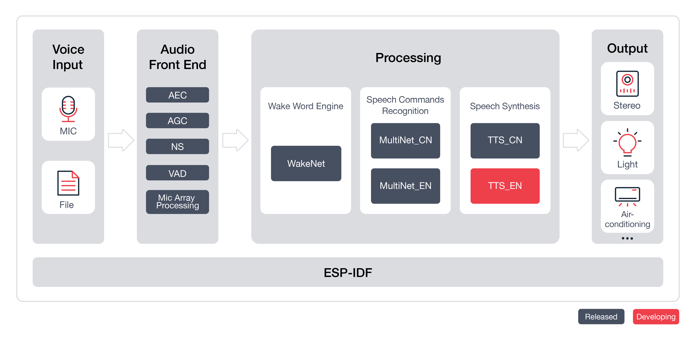
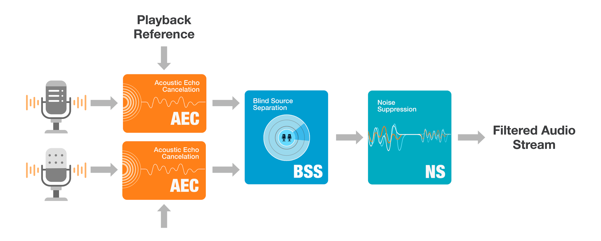

# ESP-Skainet [[中文]](./README_cn.md)

ESP-Skainet is Espressif's intelligent voice assistant, which currently supports the Wake Word Engine and Speech Commands Recognition.

### ESP32-S3 is recommend to run speech commands recognition, which supports AI instructions and high-speed octal SPI PSRAM. The Latest models will be deployed on ESP32-S3 first.

# Overview

ESP-Skainet supports the development of wake word detection and speech commands recognition applications based around Espressif Systems' ESP32 series chip in the most convenient way. With ESP-Skainet, you can easily build up wake word detection and speech command recognition applications.

In general, the ESP-Skainet features will be supported, as shown below:



## Input Voice Stream

The input audio stream can come from any way of providing voice, such as MIC, wav/pcm files in flash/SD Card.

## Wake Word Engine

Espressif wake word engine [WakeNet](https://docs.espressif.com/projects/esp-sr/en/latest/esp32/wake_word_engine/README.html) is specially designed to provide a high performance and low memory footprint wake word detection algorithm for users, which enables devices always wait for wake words, such as "Alexa",  “天猫精灵” (Tian Mao Jing Ling), and “小爱同学” (Xiao Ai Tong Xue).  

Currently, Espressif has not only provided an official wake word "Hi, Lexin" to the public for free but also allows customized wake words. For details on how to customize your own wake words, please see [Espressif Speech Wake Words Customization Process](https://docs.espressif.com/projects/esp-sr/en/latest/esp32/wake_word_engine/ESP_Wake_Words_Customization.html).

## Speech Commands Recognition

Espressif's speech command recognition model [MultiNet](https://docs.espressif.com/projects/esp-sr/en/latest/esp32/speech_command_recognition/README.html) is specially designed to provide a flexible offline speech command recognition model. With this model, you can easily add your own speech commands, eliminating the need to train model again.

Currently, Espressif **MultiNet** supports up to 200 Chinese or English speech commands, such as “打开空调” (Turn on the air conditioner) and “打开卧室灯” (Turn on the bedroom light). 

## Audio Front End

Espressif Audio Front-End [AFE](https://docs.espressif.com/projects/esp-sr/en/latest/esp32/audio_front_end/index.html) integrates AEC (Acoustic Echo Cancellation),  VAD (Voice Activity Detection),BSS (Blind Source Separation) and NS (Noise Suppression).    

Our two-mic Audio Front-End (AFE) have been qualified as a “Software Audio Front-End Solution” for [Amazon Alexa Built-in devices](https://developer.amazon.com/en-US/alexa/solution-providers/dev-kits#software-audio-front-end-dev-kits).
    
  
  
# Quick Start with ESP-Skainet

## Hardware Preparation

To run ESP-Skainet, you need to have an ESP32 or ESP32-S3 development board which integrates an audio input module .
Development board Support:

|                          Example Name                               |   Latest Models   |  Supported Board   |
| :------------------------------------------------------------------ | :---------------: | :-------------- |
| [cn_speech_commands_recognition](./cn_speech_commands_recognition) | MultiNet7      | [ESP32-Korvo](https://github.com/espressif/esp-skainet/blob/master/docs/en/hw-reference/esp32/user-guide-esp32-korvo-v1.1.md), [ESP32-S3-Korvo-1](https://github.com/espressif/esp-skainet/blob/master/docs/en/hw-reference/esp32s3/user-guide-korvo-1.md), [ESP-BOX](https://github.com/espressif/esp-box), [ESP-S3-Korvo-2](https://docs.espressif.com/projects/esp-adf/en/latest/get-started/user-guide-esp32-s3-korvo-2.html), [ESP32-S3-EYE](https://www.espressif.com/en/products/devkits/esp-s3-eye/overview), [ESP32-P4-Function-EV](https://docs.espressif.com/projects/esp-dev-kits/en/latest/esp32p4/esp32-p4-function-ev-board/user_guide.html#getting-started)|
| [en_speech_commands_recognition](./en_speech_commands_recognition) | MultiNet7      | [ESP32-S3-Korvo-1](https://github.com/espressif/esp-skainet/blob/master/docs/en/hw-reference/esp32s3/user-guide-korvo-1.md), [ESP-BOX](https://github.com/espressif/esp-box), [ESP-S3-Korvo-2](https://docs.espressif.com/projects/esp-adf/en/latest/get-started/user-guide-esp32-s3-korvo-2.html), [ESP32-S3-EYE](https://www.espressif.com/en/products/devkits/esp-s3-eye/overview), [ESP32-P4-Function-EV](https://docs.espressif.com/projects/esp-dev-kits/en/latest/esp32p4/esp32-p4-function-ev-board/user_guide.html#getting-started)|
| [wake_word_detection](./wake_word_detection)                       | Wakenet9       | [ESP32-Korvo](https://github.com/espressif/esp-skainet/blob/master/docs/en/hw-reference/esp32/user-guide-esp32-korvo-v1.1.md), [ESP32-S3-Korvo-1](https://github.com/espressif/esp-skainet/blob/master/docs/en/hw-reference/esp32s3/user-guide-korvo-1.md), [ESP-BOX](https://github.com/espressif/esp-box), [ESP-S3-Korvo-2](https://docs.espressif.com/projects/esp-adf/en/latest/get-started/user-guide-esp32-s3-korvo-2.html), [ESP32-S3-EYE](https://www.espressif.com/en/products/devkits/esp-s3-eye/overview), [ESP32-P4-Function-EV](https://docs.espressif.com/projects/esp-dev-kits/en/latest/esp32p4/esp32-p4-function-ev-board/user_guide.html#getting-started)|
| [chinese_tts](./chinese_tts)                                       | esp-tts-v1.7    | [ESP32-Korvo](https://github.com/espressif/esp-skainet/blob/master/docs/en/hw-reference/esp32/user-guide-esp32-korvo-v1.1.md), [ESP32-S3-Korvo-1](https://github.com/espressif/esp-skainet/blob/master/docs/en/hw-reference/esp32s3/user-guide-korvo-1.md), [ESP-BOX](https://github.com/espressif/esp-box), [ESP-S3-Korvo-2](https://docs.espressif.com/projects/esp-adf/en/latest/get-started/user-guide-esp32-s3-korvo-2.html), [ESP32-P4-Function-EV](https://docs.espressif.com/projects/esp-dev-kits/en/latest/esp32p4/esp32-p4-function-ev-board/user_guide.html#getting-started)|
| [usb_mic_recorder](./usb_mic_recorder)                                       |      | [ESP-BOX](https://github.com/espressif/esp-box), [ESP-S3-Korvo-2](https://docs.espressif.com/projects/esp-adf/en/latest/get-started/user-guide-esp32-s3-korvo-2.html)|

On how to configure your applications, please refer to the README.md of each example.

## Software Preparation

### ESP-Skainet
Clone this project as follows:

```
git clone https://github.com/espressif/esp-skainet.git 
```

### ESP-IDF

 [ESP-IDF v4.4](https://github.com/espressif/esp-idf/tree/release/v4.4) and [ESP-IDF v5.0](https://github.com/espressif/esp-idf/tree/release/v5.0) are supported. If you had already configured ESP-IDF before, and do not want to change your existing one, you can configure the `IDF_PATH` environment variable to the path to ESP-IDF. 

For details on how to set up the ESP-IDF, please refer to [Getting Started Guide for ESP-IDF release/v4.4 branch](https://docs.espressif.com/projects/esp-idf/en/release-v4.4/esp32/get-started/index.html)

# Examples
The folder of [examples](examples) contains some applications demonstrating the API features of ESP-Skainet.

Please start with the [wake_word_detection](./examples/wake_word_detection)  example.

1. Navigate to one example folder `esp-skainet/examples/wake_word_detection).
```
cd esp-skainet/examples/wake_word_detection
```

2. Compile and flash the project.
```
idf.py flash monitor
```
3. Advanced users can add or modify speech commands by using the `idf.py menuconfig` command.


For details, please read the README file in each example.


# Resources

* [View the Issues section on GitHub](https://github.com/espressif/esp-skainet/issues) if you find a bug or have a feature request, please check existing Issues before opening a new one.

* If you are interested in contributing to ESP-Skainet, please check the [Contributions Guide](https://docs.espressif.com/projects/esp-idf/en/latest/esp32/contribute/index.html).
