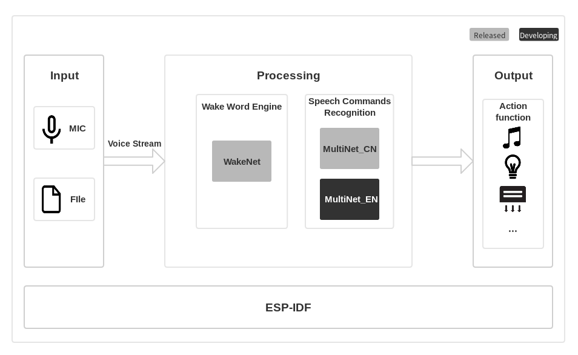

# ESP-Skainet [[中文]](./README_cn.md)

ESP-Skainet is Espressif's intelligent voice assistant, which currently supports the Wake Word Engine and Speech Commands Recognition.

# Overview

ESP-Skainet supports the development of wake word detection and speech commands recognition applications based around Espressif Systems' ESP32 chip in the most convenient way. With ESP-Skainet, you can easily build up wake word detection and speech command recognition applications.

In general, the ESP-Skainet features will be supported, as shown below:



## Input Voice Stream

The input audio stream can come from any way of providing voice, such as MIC, wav/pcm files in flash/TF Card.

## Wake Word Engine

Espressif wake word engine [WakeNet](https://github.com/espressif/esp-sr/tree/master/wake_word_engine/README.md) is specially designed to provide a high performance and low memory footprint wake word detection algorithm for users, which enables devices always wait for wake words, such as "Alexa",  “天猫精灵” (Tian Mao Jing Ling), and “小爱同学” (Xiao Ai Tong Xue).  

Currently, Espressif has not only provided an official wake word "Hi, Lexin" to the public for free but also allows customized wake words. For details on how to customize your own wake words, please see [Espressif Speech Wake Words Customization Process](https://github.com/espressif/esp-sr/tree/master/wake_word_engine/ESP_Wake_Words_Customization.md).

## Speech Commands Recognition

Espressif's speech command recognition model [MultiNet](https://github.com/espressif/esp-sr/tree/master/speech_command_recognition/README.md) is specially designed to provide a flexible offline speech command recognition model. With this model, you can easily add your own speech commands, eliminating the need to train model again.

Currently, Espressif **MultiNet** supports up to 100 Chinese speech commands, such as “打开空调” (Turn on the air conditioner) and “打开卧室灯” (Turn on the bedroom light). 

We will add supports for English commands in the next release.

## Acoustic Algorithm

Now, ESP-Skainet integrates AEC (Acoustic Echo Cancellation), AGC (automatic_gain_control), NS (Noise Suppression), VAD (Voice Activity Detection) and Beamforming algorithm.

# Quick Start with ESP-Skainet

## Hardware Preparation

To run ESP-Skainet, you need to have an ESP32 development board which integrates an audio input module and at least **4 MB** of external SPI RAM. We use [ESP32-LyraT-Mini](https://docs.espressif.com/projects/esp-adf/en/latest/get-started/get-started-esp32-lyrat-mini.html) or [ESP32-LyraT V4.3](https://docs.espressif.com/projects/esp-adf/en/latest/get-started/get-started-esp32-lyrat.html) in examples.

On how to configure ESP32 module for your applications, please refer to the README.md of each example.

## Software Preparation

### Audio Config

During the wake word detection and speech commands recognition, the board will pick up audio data with the on-board microphone, and feed them to the WakeNet/MultiNet model frame by frame (30 ms, 16 KHz, 16 bit, mono).

### ESP-Skainet
Make sure you have cloned this project with the `--recursive` option, shown as follows:

```
git clone --recursive https://github.com/espressif/esp-skainet.git 
```

If you have cloned this project without the `--recursive` option, please go to the `esp-skainet` directory and run the `git submodule update --init`  command before anything else.

### ESP-IDF

In this case, we take [ESP-IDF v3.2](https://github.com/espressif/esp-idf/releases/v3.2) as the test version. If you had already configured ESP-IDF before, and do not want to change your existing one, you can configure the `IDF_PATH` environment variable to the path to ESP-IDF.

For details on how to set up the ESP-IDF, please refer to [Getting Started Guide for the stable ESP-IDF version](https://docs.espressif.com/projects/esp-idf/en/stable/get-started-cmake/index.html)
 
# Components

A component is the main framework of the SDK, with some drivers and algorithm inside.

## hardware_driver

The hardware_driver component contains drivers for the ESP32-LyraT-Mini board and ESP32-LyraT V4.3 board.

## esp-sr

The [esp-sr](https://github.com/espressif/esp-sr/tree/master) component contains the APIs of ESP-Skainet neural networks, including the wake word detection and speech commands recognition framework.

# Examples
The folder of [examples](examples) contains sample applications demonstrating the API features of ESP-Skainet.

Take one Garbage classification as an example.

1. Navigate to one example folder `esp-skainet/examples/garbage_classification`.
```
cd esp-skainet/examples/garbage_classification
```

2. Compile and flash the project.
```
make
make flash monitor
```
3. Advanced users can add or modify speech commands by using the `make menuconfig` command.


For details, please read the README file in each example.


# Resources

* [View the Issues section on GitHub](https://github.com/espressif/esp-skainet/issues) if you find a bug or have a feature request, please check existing Issues before opening a new one.

* If you are interested in contributing to ESP-Skainet, please check the [Contributions Guide](https://esp-idf.readthedocs.io/en/latest/contribute/index.html).
