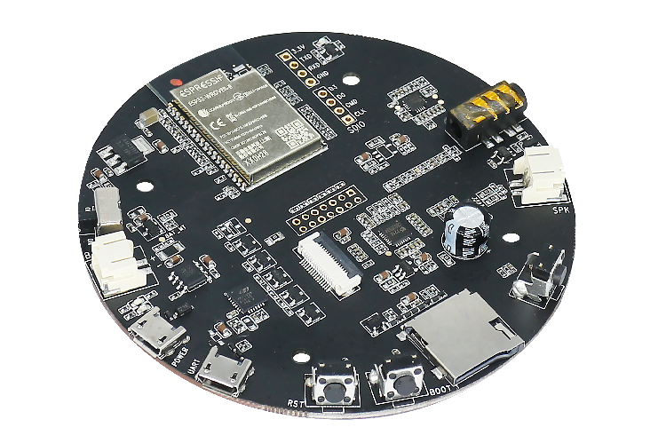
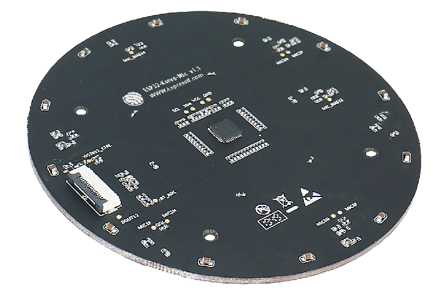
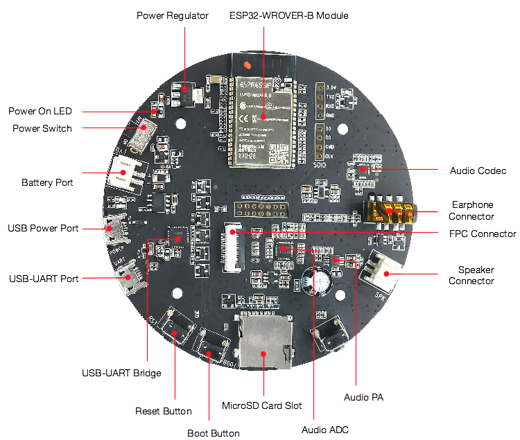

# ESP32-Korvo 用户指南

* [English Version](../../../en/hw-reference/esp32/user-guide-esp32-korvo-v1.1.md)

本指南介绍了乐鑫的开发板 ESP32-Korvo。

ESP32-Korvo 是一个基于双核 ESP32、搭载麦克风阵列的音频开发板，配合乐鑫语音识别 SDK ESP-Skainet，适用于远场低功耗语音识别应用，例如智能语音面板、语音插座、智能语音开关等。

|||
|:- |:- |
|ESP32-Korvo|ESP32-Korvo Mic|

本指南包括如下内容：

* [入门指南](#入门指南): 简要介绍了 ESP32-Korvo 和硬件、软件设置指南。
* [硬件参考](#硬件参考): 详细介绍了 ESP32-Korvo 的硬件。
* [相关文档](#相关文档): 列出了相关文档的链接。

# 1. 入门指南

本节介绍了如何快速上手 ESP32-Korvo。开头部分介绍了 ESP32-Korvo，[开始开发应用](#开始开发应用) 小节介绍了怎样在 ESP32-Korvo 上安装模组、设置和烧录固件。

## 1.1 概述

ESP32-Korvo 是一个基于双核 ESP32、搭载麦克风阵列的音频开发板，配合乐鑫语音识别 SDK ESP-Skainet，适用于远场低功耗语音识别应用，例如智能语音面板、语音插座、智能语音开关等。

不同于乐鑫其他的音频开发板，ESP32-Korvo 用单颗 ESP32 芯片实现远场本地语音识别，支持双麦、三麦、六麦阵列，配合波束成形 (beamforming)、AEC 等语音增强算法，满足多种场景下的语音识别需求。

## 1.2 内含组件和包装

### 1.2.1 零售订单

如购买样品，每个 ESP32-Korvo 将单独包装，内含：
* ESP32-Korvo 主板
* ESP32-Korvo 麦克风阵列板
* FPC 排线
* 8 个螺丝
* 4 个螺柱

零售订单请前往 <https://www.espressif.com/zh-hans/company/contact/buy-a-sample>。

### 1.2.2 批量订单

如批量购买，开放版将以大纸板箱包装。

批量订单请参考[乐鑫产品订购信息](https://www.espressif.com/sites/default/files/documentation/espressif_products_ordering_information_cn.pdf) (PDF) 。

## 1.3 组件介绍

|主要组件|介绍|
|:- |:- |
|ESP32-WROVER-B|这款 ESP32 模组内置 ESP32 芯片、64 Mbit SPI flash 和 128 Mbit PSRAM，可灵活存储数据，具有 Wi-Fi / BT 连接和数据处理能力。|
|电源稳压器|5 V 转 3.3 V 稳压器。|
|电源开关|拨动至 On，开发板上电；拨动至 Off，开发板断电。|
|电池接口|连接电池。|
|USB 电源接口|为开发板供电。|
|USB 转 UART 接口|电脑和 ESP32-WROVER-B 之间的通信接口。|
|USB 转 UART 桥接器|单芯片 USB-UART 桥接器，可提供高达 3 Mbps 的传输速率。|
|Reset 键|按住此键使系统复位。|
|Boot 键 |下载按键。按住 Boot 键的同时按一下 EN 键进入"固件下载"模式，通过串口下载固件。|
|Micro SD 卡槽| 适用于需要扩充数据存储空间或备份的应用开发场景。|
|音频模数转换器| 高性能四通道音频模数转换器，其中三个通道用于麦克风，一个通道用于回声消除 (AEC) 功能。|
|音频功率放大器|放大外接扬声器的音频信号，最大至 3 W。|
|音频编解码器|音频编解码器 ES8311 通过 I2S 总线将数字信号转换为模拟信号与 ESP32 通信。|
|扬声器连接器|外接扬声器。|
|耳机连接器| 外接耳机。|
|FPC 连接器|连接主板和子板。|
|模拟麦克风|六个模拟麦克风阵列，间隔 65 mm。|
|RGB LED|12 个可寻址红绿蓝发光二极管 (WS2812)。|
|Function 键 |六个功能键，分别是 PLAY, SET, VOL -, VOL +, MODE 和 REC。这六个功能键可由用户定义。|

## 1.4 开始开发应用

通电前，请确保 ESP32-Korvo 完好无损。

### 1.4.1 必备硬件

* ESP32-Korvo
* 两根 USB 2.0 数据线（标准 A 型转 Micro-B 型）
* 4 欧姆扬声器或耳机
* 电脑（Windows、Linux 或 macOS）

### 1.4.2 硬件设置

1. 使用 FPC 排线连接 ESP32-Korvo 麦克风阵列板和 ESP32-Korvo 主板。
2. 将 4 欧姆扬声器接至扬声器连接器，或将耳机接至耳机连接器。
3. 使用两根 USB 数据线连接电脑与 ESP32-Korvo 的两个 USB 接口。
4. 打开电源开关。
5. 电源指示 LED 应该亮红灯。

### 1.4.3 软件设置

# 2. 硬件参考

## 2.1 功能框图

ESP32-Korvo 的主要组件和连接方式如下图所示。

# 3. 相关文档

* [ESP32-Korvo 主板原理图](https://dl.espressif.com/dl/schematics/ESP32-KORVO_V1.1_schematics.pdf) (PDF)
* [ESP32-Korvo 麦克风阵列板原理图](https://dl.espressif.com/dl/schematics/ESP32-KORVO-MIC_V1.1_schematics.pdf) (PDF)
* [ESP32-Korvo 参考设计]() (ZIP)
* [ESP32 技术规格书](https://www.espressif.com/sites/default/files/documentation/esp32_datasheet_cn.pdf) (PDF)
* [ESP32-WROVER-B 技术规格书](https://www.espressif.com/sites/default/files/documentation/esp32-wrover-b_datasheet_cn.pdf)(PDF)
* [ESP32-WROVER-B-V1 参考设计](https://www.espressif.com/sites/default/files/documentation/ESP32-WROVER-B_Reference_Design_V1-r1.0_0.zip) (ZIP)
* [乐鑫产品订购信息](https://www.espressif.com/sites/default/files/documentation/espressif_products_ordering_information_cn.pdf)  (PDF)
