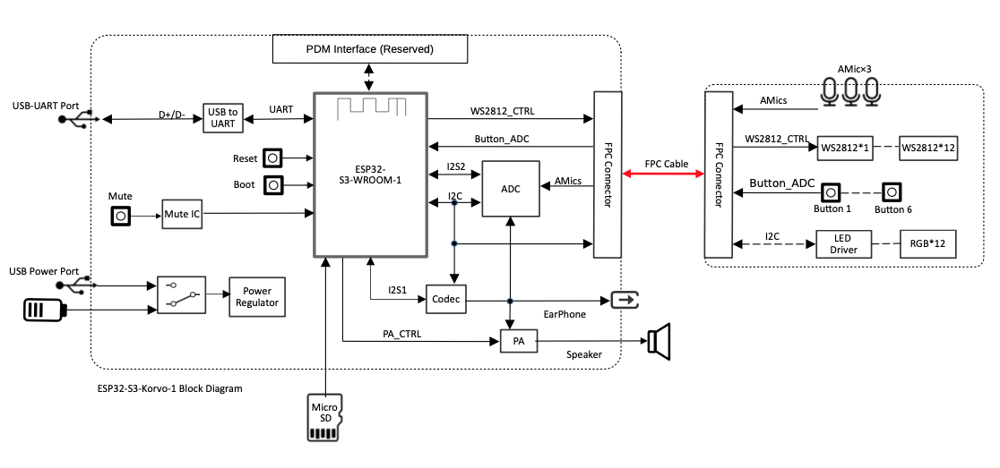
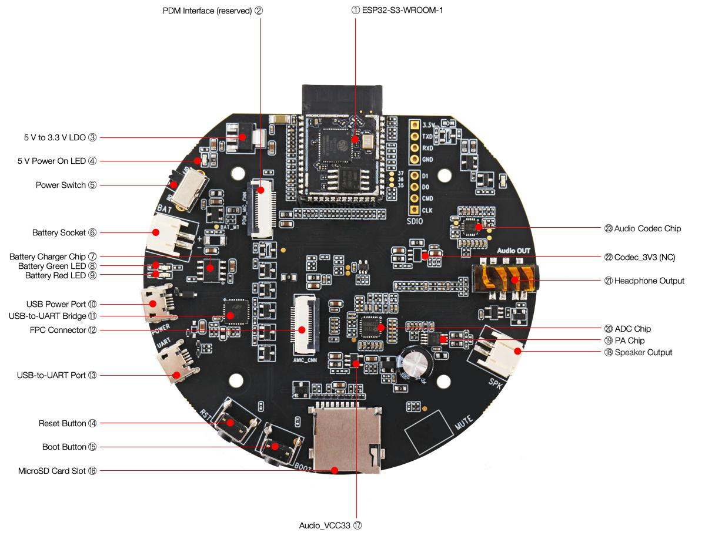
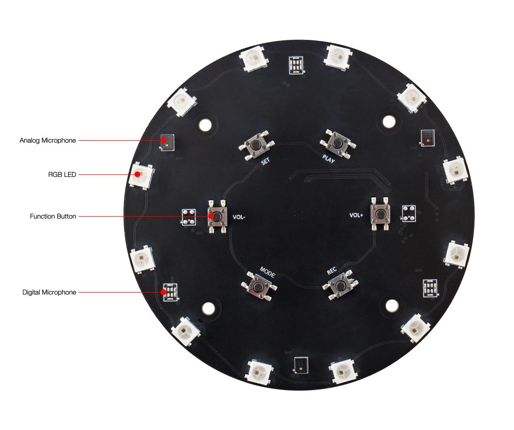
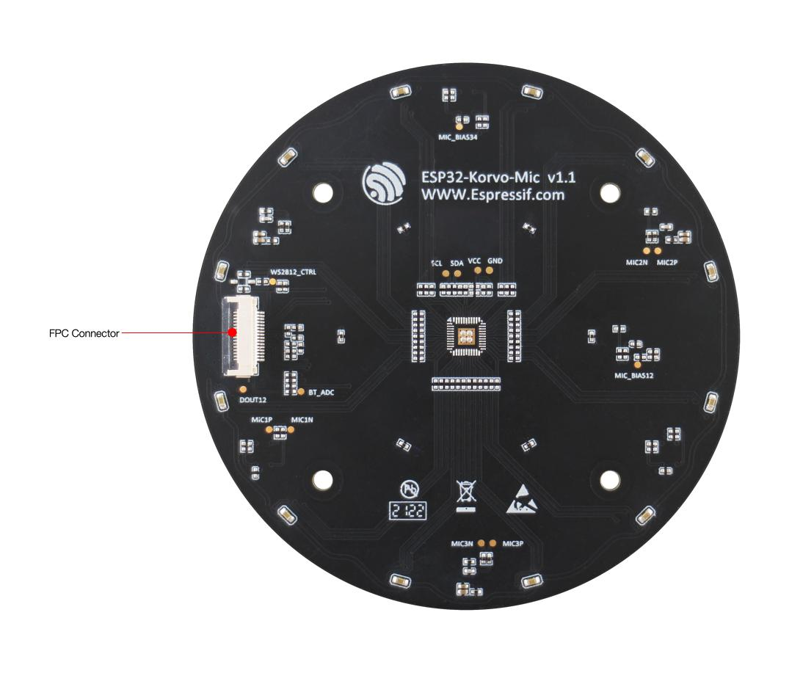
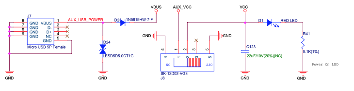
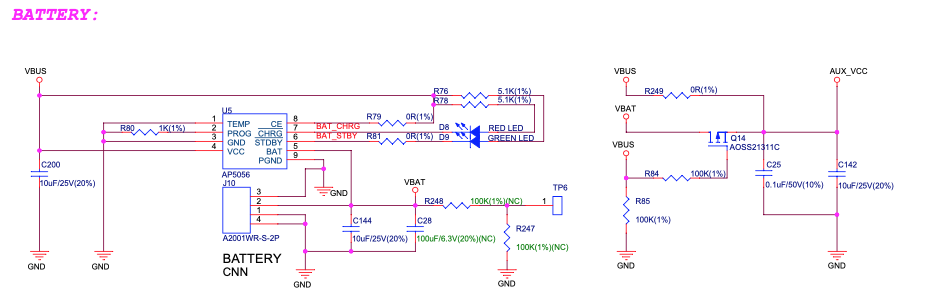
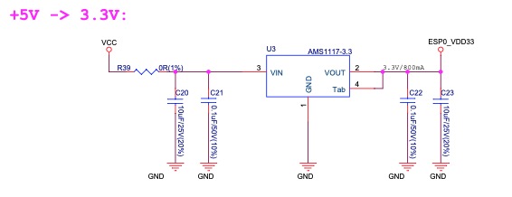
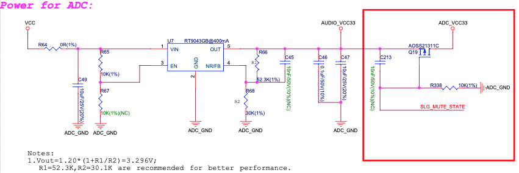
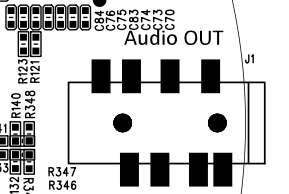
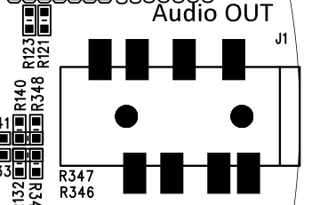

# ESP32-S3-Korvo-1 v5.0 <!-- omit in toc -->

[English Version](../../../en/hw-reference/esp32s3/user-guide-korvo-1.md)

- [1. 入门指南](#1-入门指南)
  - [1.1. 概述](#11-概述)
  - [1.2. 功能框图](#12-功能框图)
  - [1.3. ESP32-S3-Korvo-1 主板组件](#13-esp32-s3-korvo-1-主板组件)
  - [1.4. ESP32-Korvo-Mic 子板组件](#14-esp32-korvo-mic-子板组件)
  - [1.5. 内含组件和包装](#15-内含组件和包装)
    - [1.5.1. 零售订单](#151-零售订单)
    - [1.5.2. 批量订单](#152-批量订单)
  - [1.6. 默认固件和功能测试](#16-默认固件和功能测试)
- [2. 开始开发应用](#2-开始开发应用)
  - [2.1. 必备硬件](#21-必备硬件)
  - [2.2. 可选硬件](#22-可选硬件)
  - [2.3. 电源选项](#23-电源选项)
  - [2.4. 硬件设置](#24-硬件设置)
  - [2.5. 软件设置](#25-软件设置)
- [3. 硬件参考](#3-硬件参考)
  - [3.1. GPIO 分配](#31-gpio-分配)
  - [3.2. 电路分布](#32-电路分布)
    - [3.2.1. 独立的 USB 供电与电池供电电路](#321-独立的-usb-供电与电池供电电路)
    - [3.2.2. 独立的模组与音频供电电路](#322-独立的模组与音频供电电路)
  - [3.3. 选择音频输出方式](#33-选择音频输出方式)
- [4. 硬件版本](#4-硬件版本)
- [5. 相关文档](#5-相关文档)
  - [5.1. 技术规格书](#51-技术规格书)
  - [5.2. 原理图](#52-原理图)
  - [5.3. PCB 布局图](#53-pcb-布局图)
  - [5.4. 尺寸图](#54-尺寸图)

本指南将帮助您快速上手 ESP32-S3-Korvo-1 v5.0，并提供该款开发板的详细信息。

> **注意**
>
> 如果您使用的是 ESP32-S3-Korvo-1 v4.0，请参考本指南。v5.0 相对 v4.0 的变化在[硬件版本](#4-硬件版本)小节中列出。

ESP32-S3-Korvo-1 是[乐鑫](https://www.espressif.com/zh-hans/home)推出的一款 AI（人工智能）开发板，搭载 [ESP32-S3](https://www.espressif.com/zh-hans/products/socs/esp32-s3) 芯片和乐鑫语音识别 SDK [ESP-Skainet](https://www.espressif.com/zh-hans/solutions/audio-solutions/esp-skainet/overview)。板上配置三麦克风阵列，适用于远场拾音，且功耗低。ESP32-S3-Korvo-1 支持中英文语音唤醒和离线语音命令识别。您可以使用 ESP-Skainet 开发各种语音识别应用，例如智能屏幕、智能插头、智能开关等。

|  | 
|:--:| 
|ESP32-S3-Korvo-1|

本指南包括如下内容：

-  [入门指南](#1-入门指南)：介绍了开发板的功能和特性、组件、包装，以及如何快速使用开发板。
-  [开始开发应用](#2-开始开发应用)：说明了开发板烧录固件需要的硬件设置和软件设置。
-  [硬件参考](#3-硬件参考)：详细介绍了开发板的硬件。
-  [硬件版本](#4-硬件版本)：介绍硬件历史版本和已知问题，并提供链接至历史版本开发板的入门指南（如有）。
-  [相关文档](#5-相关文档)：列出了相关文档的链接。

# 1. 入门指南

## 1.1. 概述

ESP32-S3-Korvo-1 开发板包含两部分：一块主板 ESP32-S3-Korvo-1，配置 ESP32-S3-WROOM-1 模组、功能按键、SD 卡槽、扬声器接口和 USB 接口等；一块子板 ESP32-Korvo-Mic（也是 [ESP32-Korvo v1.1](https://github.com/espressif/esp-skainet/blob/master/docs/zh_CN/hw-reference/esp32/user-guide-esp32-korvo-v1.1.md) 的子板），配置三麦克风阵列、功能按键、可寻址 LED 等。主板和子板通过 FPC 排线连接。

## 1.2. 功能框图

功能框图显示了主板 ESP32-S3-Korvo-1（左侧）和子板 ESP32-Korvo-Mic（右侧）的主要组件，以及组件之间的连接方式。

|  | 
|:--:| 
|ESP32-S3-Korvo-1 功能框图|

下面分别介绍主板和子板上的主要组件。

## 1.3. ESP32-S3-Korvo-1 主板组件

|  | 
|:--:| 
|ESP32-S3-Korvo-1 - 正面|

下面从 ESP32-S3-WROOM-1 模组开始逆时针依次介绍主板上的主要组件。

| 序号 | 主要组件|       介绍 |
|-----|--------------------------|--|
| 1   | ESP32-S3-WROOM-1         | ESP32-S3-WROOM-1 模组，内置 ESP32-S3R8 芯片，集成 Wi-Fi 和 Bluetooth 5 (LE) 子系统，还有专门的向量指令用于加速神经网络计算和信号处理。ESP32-S3R8 芯片叠封 8 MB PSRAM，模组还另外带有 16 MB flash，可灵活高效读取数据。 |
| 2   | PDM Interface（预留 PDM 接口）| 子板可选择连接 PDM 接口，使用 3 个脉冲密度调制 (PDM) 数字麦阵列。|
| 3   | 5 V to 3.3 V LDO（5 V 转 3.3 V LDO）        | 模组电路的电源转换器，输入 5 V，输出 3.3 V。|
| 4   | 5 V Power On LED（5 V 电源指示灯）         | 开发板连接 USB 电源，并且**电源开关**拨至 "ON"，5 V 电源指示灯红灯亮起。|
| 5   | Power Switch（电源开关）             | 拨动至 "ON"，开发板上电：拨动至 "OFF"，开发板断电。 |
| 6   | Battery Socket（电池接口）          | 外接锂电池，与 USB 供电二选一。请使用带有保护电路板和电流保险器组件的锂电池。建议电池规格：容量 >1000 mAh, 输出电压 3.7 V， 输入电压 4.2 V – 5 V。装电池时注意正负极性与接口标示的正负极性相匹配。|
| 7   | Battery Charger Chip（电池充电芯片）     | AP5056，1 A 线性锂电池充电器。充电电源来自 **USB 供电接口**。|
| 8   | Battery Green LED（电池指示绿灯）        | 开发板连接 USB 电源，不接电池的情况下，绿灯亮。接电池状态下，在电池充电完成后，绿灯亮。|
| 9   | Battery Red LED（电池指示红灯）         | 开发板连接 USB 电源，不接电池的情况下，红灯闪烁。接电池状态下，电池充电正在进行时，红灯亮；电池充电完成后，红灯灭。|
| 10  | USB Power Port（USB 供电接口）          | 开发板的供电接口。|
| 11  | USB-to-UART Bridge（USB 至 UART 桥接器）       | 单芯片 USB 至 UART 桥接器，可提供高达 3 Mbps 的传输速率。 |
| 12  | FPC Connector（FPC 接口）            | 通过 FPC 排线连接主板和子板。 |
| 13  | USB-to-UART Port（USB 转 UART 接口）         | 作为通信接口，通过板载 **USB 至 UART 桥接器**与芯片通信。 |
| 14  | Reset Button（复位按键）             | 芯片复位按键。 |
| 15  | Boot Button（下载按键）              | 下载按键。按住 **Boot 键**的同时按一下 **Reset 键**进入“固件下载”模式，通过串口下载固件。 |
| 16  | MicroSD Card Slot（MicroSD 卡槽）        | 可插入 MicroSD 卡，适用于需要扩充数据存储空间或备份的应用开发场景。支持 SPI 模式。 |
| 17  | Audio_VCC33              | 音频电路的电源转换器，输入 5 V， 输出 3.3 V。 |
| 18  | Speaker Output（扬声器输出）           | 音频输出插槽，外接扬声器。采用 2.00 mm / 0.08” 排针间距，建议使用 4 欧姆 3 瓦特扬声器。 |
| 19  | PA Chip（PA 芯片）                  | 超低 EMI，无需滤波器，3 瓦特单声道 D 类音频功放。 |
| 20  | ADC Chip（ADC 芯片）                 | 音频 4 通道模拟转数字芯片 (ES7210)，多位 delta-sigma 音频ADC，102 dB 信噪比，–85 dB THD+N，24 位 8 - 100 kHz 采样频率，I2S/PCM 主从串行数据端口，支持 TDM 模式。通过 I2S 和 I2C 与 ESP32-S3 通信。 |
| 21  | Headphone Output（耳机输出）         | 音频输出插槽，外接 3.5 mm 立体声耳机。（请注意，此开发板输出单声道信号。） |
| 22  | Codec_3V3 (NC)           | Codec 的额外电源选项，默认不使用、不上件。 |
| 23  | Audio Codec Chip（音频编解码芯片）         |使用 [ES8311](http://www.everest-semi.com/pdf/ES8311%20PB.pdf) 低功耗单声道音频编解码器。它由单通道 ADC、单通道 DAC、低噪声前置放大器、耳机驱动程序、数字音效处理器、模拟混音器和增益函数组成。该芯片通过 I2S 和 I2C 总线与 **ESP32-S3-WROOM-1** 模组连接提供硬件音频处理功能。  |

## 1.4. ESP32-Korvo-Mic 子板组件

|  | 
|:--:| 
|ESP32-Korvo-Mic - 正面|

|  | 
|:--:| 
|ESP32-Korvo-Mic - 背面|

下面从上到下依次介绍子上的主要组件。

| 主要组件      | 介绍 |
|--------------------|----|
| Analog Microphone（模拟麦克风）  | 与另外两个模拟麦克风组成三个模拟麦克风阵列，间隔 65 mm。硬件也支持两个模拟麦克风阵列，间隔 55 mm（硬件默认不上件，软件暂不支持）。|
| RGB LED            | 12 个可寻址 RGB LED (WS2812C)。 |
| Function Button（功能按键）    | 板子上有 6 个功能按键，您可以自定义功能。 |
| Digital Microphone（数字麦克风） | 硬件支持三个数字麦克风阵列，间隔 65 mm（硬件默认不上件，软件暂不支持）。 |
| FPC Connector（FPC 接口）      | 通过 FPC 排线连接主板和子板。            |

## 1.5. 内含组件和包装

### 1.5.1. 零售订单

如购买样品，每个开发板将以防静电袋或零售商选择的其他方式包装。每个包装内含：

-   1 块 ESP32-S3-Korvo-1 主板
-   1 块 ESP32-Korvo-Mic 子板
-   FPC 排线
-   8 个螺丝
-   4 个螺柱

这些组件出厂时都已组装好。

零售订单请前往 <https://www.espressif.com/zh-hans/company/contact/buy-a-sample>。

### 1.5.2. 批量订单

如批量购买，开发板将以大纸板箱包装。

批量订单请前往 <https://www.espressif.com/zh-hans/contact-us/sales-questions>。

## 1.6. 默认固件和功能测试

ESP32-S3-Korvo-1 出厂即烧录[默认固件](https://github.com/espressif/esp-skainet/blob/master/tools/default_firmware/default_firmware_ESP32-S3-Korvo-1)，方便您立即上手使用开发板，体验语音唤醒和语音命令识别的功能。

> **注意**
>
> 请注意，默认固件仅支持中文唤醒词和语音命令。您也可以参考 [esp-skainet/examples](https://github.com/espressif/esp-skainet/tree/master/examples) 配置使用英语唤醒词和语音命令。如需配置英语唤醒词和语音命令，请首先按照[第 2 节](#2-start-application-development)中的步骤进行操作。

使用开发板前，您需要准备以下硬件：

-   1 套 ESP32-S3-Korvo-1 开发板
-   1 根 USB 2.0 数据线（标准 A 型转 Micro-B 型），为开发板接入电源

通电前，请确保开发板完好无损，主板与子板已组装好。然后按照以下步骤开始使用开发板：

1. 使用 USB 数据线连接开发板的 **USB 供电接口**与电源。**电池指示绿灯**应亮起。如果未接入电池，则**电池指示红灯**闪烁。
2. 将**电源开关**拨至 "ON"。**5 V 电源指示灯**红灯亮起。
3. 按下**复位按键**。
4. 说出中文唤醒词“Hi 乐鑫”唤醒开发板。唤醒后，子板上的 12 个 RGB LED 将被循环点亮为白色，表示设备正在等待命令词。
5. 说出中文命令词，等待开发板执行命令。默认固件支持的中文命令词请见下表。

| 默认固件支持的中文命令词 | 设备反馈           |
|-------------------------------|----------------------|
| 关闭电灯                        | RGB LED 熄灭     |
| 打开白色灯                      | RGB LED 显示白色 |
| 打开红色灯                      | RGB LED 显示红色   |
| 打开绿色灯                      | RGB LED 显示绿色  |
| 打开蓝色灯                      | RGB LED 显示蓝色  |
| 打开黄色灯                      | RGB LED 显示黄色 |
| 打开青色灯                      | RGB LED 显示青色   |
| 打开紫色灯                      | RGB LED 显示紫色 |

如果没有识别到命令词，RGB LED 将恢复至唤醒前的状态。

至此您已经体验了开发板的主要功能。下面的章节将说明如何在开发板上烧录固件、硬件资源和相关文档等。

# 2. 开始开发应用

本小节介绍如何在开发板上烧录固件以及相关准备工作。

## 2.1. 必备硬件

-  1 套 ESP32-S3-Korvo-1 开发板
-  2 根 USB 2.0 数据线（标准 A 型转 Micro-B 型），一根用来给开发板接入电源，一根用来向开发板烧录固件。
-  4 欧姆、3 瓦特扬声器，或 3.5 mm 插头的耳机。若使用扬声器，建议功率不超过 3 瓦特，另外需要接口为 JST PH 2.0 mm 2 针的插头，若没有此插头，可使用杜邦母跳线。
-  1 台电脑（Windows、Linux 或 macOS）

## 2.2. 可选硬件

-   1 个 MicroSD 存储卡
-   1 块锂电池

> **注意**
>
> 请使用带有保护电路板的锂电池。

## 2.3. 电源选项

开发板有两种供电方式：

-   USB 接口供电
-   外接锂电池供电

## 2.4. 硬件设置

按照以下步骤设置开发板：

1. 使用 USB 数据线连接开发板的 **USB 供电接口**与电源。**电池指示绿灯**应亮起。如果未接入电池，则**电池指示红灯**闪烁。
2. 将**电源开关**拨至 "ON"。**5 V 电源指示灯**红灯亮起。
3. 使用 USB 数据线连接开发板的 **USB 至 UART 桥接器**与电脑。
4. 将扬声器插入**扬声器输出**接口，或将耳机插入**耳机输出**接口。

硬件设置已完成，然后按照下列步骤配置软件。

## 2.5. 软件设置

准备开发工具，请前往 [ESP-Skainet](https://github.com/espressif/esp-skainet/blob/master/README_cn.md) 文档 --\> [软件准备](https://github.com/espressif/esp-skainet/blob/master/README_cn.md#软件准备)小节，查看以下步骤：

1. [获取 ESP-Skainet](https://github.com/espressif/esp-skainet/blob/master/README_cn.md#esp-skainet)，运行乐鑫智能语音助手。在 ESP-Skainet 下使用 [ESP-SR](https://github.com/espressif/esp-sr/blob/master/README.md)，查询和调用 ESP-Skainet 所需要的 API，包括唤醒词识别、语音命令词识别和前端声学算法。
2. [设置 ESP-IDF](https://github.com/espressif/esp-skainet/blob/master/README_cn.md#esp-idf)，配置基于 ESP32-S3 的 C 语言 PC 开发环境。
3. [编译、烧写和运行 ESP-Skainet 示例](https://github.com/espressif/esp-skainet/blob/master/README_cn.md#示例)。

> **说明**
>
> 您可以自定义离线唤醒词。具体请查看 [Espressif Speech Wake Word Customization Process（乐鑫唤醒词定制流程）](https://github.com/espressif/esp-sr/blob/master/docs/wake_word_engine/ESP_Wake_Words_Customization.md)。

# 3. 硬件参考

本小节介绍有关开发板硬件的更多信息。

## 3.1. GPIO 分配

**ESP32-S3-WROOM-1** 模组上的所有 GPIO 均已用于控制开发板的组件或功能。如果您想自己配置管脚，请参考[相关文档](#5-相关文档)部分提供的原理图。

## 3.2. 电路分布

### 3.2.1. 独立的 USB 供电与电池供电电路

开发板的主电源为 USB 5 V 电源，辅助电源为电池提供的 4.2 V 电源。如果要减少来自 USB 电路的干扰，可以使用电池给开发板供电。

|| 
|:--:| 
|ESP32-S3-Korvo-1 - USB 供电电路|

|| 
|:--:| 
|ESP32-S3-Korvo-1 - 电池供电电路|

### 3.2.2. 独立的模组与音频供电电路

ESP32-S3-Korvo-1 开发板为音频组件和 ESP32-S3-WROOM-1 模组提供独立电源，这样可以减少模组电路对音频电路的干扰，提高音频信号的质量。

|| 
|:--:| 
|ESP32-S3-Korvo-1 - 模组供电电路|

|| 
|:--:| 
|ESP32-S3-Korvo-1 - 音频供电电路|

## 3.3. 选择音频输出方式

开发板有两种音频输出方式，您可以任选一种：

1. 扬声器输出：默认音频输出方式，未接入耳机的情况下有效。
2. 耳机输出：接入耳机后，扬声器输出关闭，耳机输出有效。

# 4. 硬件版本

ESP32-S3-Korvo-1 v5.0 相对于 ESP32-S3-Korvo-1 v4.0 主要有两处变更：1) 主板丝印，2) 主板上 J1 右移。具体如下：

1.  主板丝印（背面）：ESP32-S3-Korvo-1 v5.0 的主板丝印为 ESP32-S3-Korvo-1 V5.0，ESP32-S3-Korvo-1 v4.0 的主板丝印为 ESP32-S3-Korvo V4.0。

| ESP32-S3-Korvo-1 v5.0 主板丝印      | ESP32-S3-Korvo-1 v4.0 主板丝印 |
|--------------------|----|
|   | |

2.  ESP32-S3-Korvo-1 v5.0 的主板 J1 右移。此变更不影响开发板性能。

| ESP32-S3-Korvo-1 v5.0 主板 J1 位置     | ESP32-S3-Korvo-1 v4.0 主板 J1 位置  |
|--------------------|----|
|   | |

3.  因主板丝印更新和 J1 右移同步更新**主板原理图**、**主板 PCB 布局图**、**主板尺寸图**、**主板尺寸图源文件**（见[相关文档](#5-相关文档)小节提供的文件）。

# 5. 相关文档

## 5.1. 技术规格书

-   [ESP32-S3 技术规格书](https://www.espressif.com/sites/default/files/documentation/esp32-s3_datasheet_cn.pdf) (PDF)
-   [ESP32-S3-WROOM-1 & ESP32-S3-WROOM-1U 技术规格书](https://www.espressif.com/sites/default/files/documentation/esp32-s3-wroom-1_wroom-1u_datasheet_cn.pdf) (PDF)

## 5.2. 原理图

-   [ESP32-S3-Korvo-1 v5.0 主板原理图](https://dl.espressif.com/dl/schematics/SCH_ESP32-S3-Korvo-1_V6_20211201.pdf) (PDF)
-   [ESP32-S3-Korvo-1 v4.0 主板原理图](https://dl.espressif.com/dl/schematics/sch_esp32-s3-korvo_v5_20211020.pdf) (PDF)
-   [ESP32-Korvo-Mic 子板原理图](https://dl.espressif.com/dl/schematics/SCH_ESP32-KORVO-MIC_V1_1_20200316A.pdf) (PDF)

## 5.3. PCB 布局图

-   [ESP32-S3-Korvo-1 v5.0 主板 PCB 布局图](https://dl.espressif.com/dl/schematics/PCB_ESP32-S3-Korvo-1_V5_20211201.pdf) (PDF)
-   [ESP32-S3-Korvo-1 v4.0 主板 PCB 布局图](https://dl.espressif.com/dl/schematics/PCB_ESP32-S3-KORVO_V4_20210719AE.pdf) (PDF)
-   [ESP32-Korvo-Mic 子板 PCB 布局图](https://dl.espressif.com/dl/schematics/PCB_ESP32-Korvo-Mic_V1_1_20200316AA.pdf) (PDF)

## 5.4. 尺寸图

-   [ESP32-S3-Korvo-1 v5.0 主板尺寸图](https://dl.espressif.com/dl/schematics/DXF_ESP32-S3-Korvo-1_V5_mb_20211207.pdf) (PDF)
-   [ESP32-S3-Korvo-1 v4.0 主板尺寸图](https://dl.espressif.com/dl/schematics/DXF_ESP32-S3-KORVO_V4_MB_20210719AE.pdf) (PDF)
-   [ESP32-Korvo-Mic 子板正面尺寸图](https://dl.espressif.com/dl/schematics/DXF_ESP32-S3-Korvo-Mic_top_V1_1_20211111.pdf) (PDF)
-   [ESP32-Korvo-Mic 子板背面尺寸图](https://dl.espressif.com/dl/schematics/DXF_ESP32-S3-Korvo-Mic_Bottom_V1_1_20211111.pdf) (PDF)
-   [ESP32-S3-Korvo-1 v5.0 主板尺寸图源文件](https://dl.espressif.com/dl/schematics/DXF_ESP32-S3-Korvo-1_V5_mb_20211207.dxf) (DXF) - 可使用 [Autodesk Viewer](https://viewer.autodesk.com/) 查看
-   [ESP32-S3-Korvo-1 v4.0 主板尺寸图源文件](https://dl.espressif.com/dl/schematics/DXF_ESP32-S3-KORVO_V4_MB_20210719AE.dxf) (DXF) - 可使用 [Autodesk Viewer](https://viewer.autodesk.com/) 查看
-   [ESP32-Korvo-Mic 子板正面尺寸图源文件](https://dl.espressif.com/dl/schematics/DXF_ESP32-S3-Korvo-Mic_top_V1_1_20211111.dxf) (DXF) - 可使用 [Autodesk Viewer](https://viewer.autodesk.com/) 查看
-   [ESP32-Korvo-Mic 子板背面尺寸图源文件](https://dl.espressif.com/dl/schematics/DXF_ESP32-S3-Korvo-Mic_Bottom_V1_1_20211111.dxf) (DXF) - 可使用 [Autodesk Viewer](https://viewer.autodesk.com/) 查看

有关本开发板的更多设计文档，请联系我们的商务部门 [<sales@espressif.com>](sales@espressif.com)。
