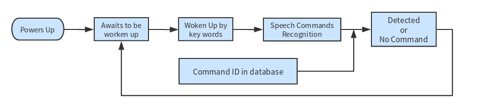
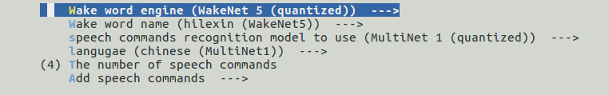

# Get Started Guide for ESP-Skainet [[中文]](./README_cn.md)

Currently, Espressif's ESP32-based speech command recognition model [MultiNet](https://github.com/espressif/esp-sr/tree/master/speech_command_recognition/README.md) supports up to **100** Chinese or English speech commands. 

This example demonstrates the basic process of recognizing Chinese speech commands with ESP32-LyraT-Mini or ESP32-Korvo V1.1. Please also see a flow diagram below.

  

For more information about ESP32-LyraT-Mini or ESP32-Korvo V1.1, please see [ESP32-LyraT-Mini Getting Started Guide](https://docs.espressif.com/projects/esp-adf/en/latest/get-started/get-started-esp32-lyrat-mini.html) or [ESP32-Korvo V1.1 Getting Started Guide](https://github.com/espressif/esp-skainet/blob/master/docs/en/hw-reference/esp32/user-guide-esp32-korvo-v1.1.md).

# 1. Quick Start

### 1.1 Hardware Configuration

  If use ESP32-Lyrat Mini V1.1, Navigate to `Audio Media HAL`, and configure the following parameters as instructed.  
  `Audio hardware board`: select `ESP32-Lyrat Mini V1.1`;  

    

  If use ESP32-Korvo V1.1, Navigate to `Audio Media HAL`, and configure the following parameters as instructed.  
  `Audio hardware board`: select `ESP32-Korvo V1.1`;    

### 1.2 Software Configuration

   Navigate to `Component config` -> `ESP Speech Recognition`, and configure the following parameters as instructed.
  - `Wake word engine`: select `WakeNet 5 (quantized)`;
  - `Wake word name`: select `hilexin (WakeNet5)`;
  - `speech commands recognition model to us`: select `MultiNet 1 (quantized)`;
  - `langugae`: select `chinese (MultiNet1)`, select `english (MultiNet1)` if use english speech command recognition;
  - `The number of speech commands`-> The number of speech commands ID;
  - `Add speech commands`-> Add the speech commands in pinyin or Phonetic symbol.

    

Then save the configuration and exit.

### 1.3 Adding Customized Speech Commands

Now, the MultiNet model predifine some speech commands. Users also can define their own speech commands and the number of speech commands ID in the `menuconfig -> Component config -> ESP Speech Recognition -> Add speech commands` and `The number of speech commands`. 

#### 1.3.1 Chinese Speech Command Recognition

The speech commands should be provided in Pinyin with spaces in between. For example, the command of “打开空调”, which means to turn on the air conditioner, should be provided as "da kai kong tiao".

#### 1.3.2 English Speech Command Recognition

The speech commands should be provided in specific phonetic symbol with spaces in between. Please use the `general_label_EN/general_label_en.py` script in the tools directory of the skainet root directory to generate the phonetic symbols corresponding to the command words. For details, please refer to [the phonetic symbol generation method](../../tools/general_label_EN/README.md). 

**Note:**
- One speech commands ID can correspond to multiple speech command phrases;
- Up to 100 speech commands ID or speech command phrases, including customized commands, are supported;
- The corresponding multiple phrases for one Command ID need to be separated by ','.

### 1.4 Binding Speech Commands to Action Functions

Users can define the action for each Command ID in the `void speech_commands_action(int command_id)` function. For example:

```
void speech_commands_action(int command_id)
{
    printf("Commands ID: %d.\n", command_id);
    switch (command_id) {
    case 0:
        // action0();
        break;
    case 1:
        // action1();
        break;
    case 2:
        // action2();
        break;
    case 3:
        // action3();
        break;
    // ...
    default:
        break;
    }
}
```

### 1.5 Compiling and Running

When you choose to use Chinese command word recognition, run `ida.py flash monitor` to compile, flash and run this example, and check the output log:

```
Quantized wakeNet5: wakeNet5_v1_hilexin_5_0.95_0.90, mode:0
Quantized MN1
I (153) MN: ---------------------SPEECH COMMANDS---------------------
I (163) MN: Command ID0, phrase 0: da kai kong tiao
I (163) MN: Command ID1, phrase 1: guan bi kong tiao
I (173) MN: Command ID2, phrase 2: da kai dian deng
I (173) MN: Command ID3, phrase 3: guan bi dian deng
I (183) MN: ---------------------------------------------------------

chunk_num = 200
-----------awaits to be waken up-----------
```

### 1.6 Waking up the Board

Find the pre-defined wake word of the board in the printed log. In this example, the wake word is “Hi Lexin" [Ləsɪ:n]. 

Then, say “Hi Lexin" ([Ləsɪ:n]) to wake up the board, which then wakes up and prints the following log:

```
hilexin DETECTED.
-----------------LISTENING-----------------
```

### 1.7 Recognizing Speech Commands

Then, the board enters the Listening status, waiting for new speech commands.

Currently, the MultiNet model already defined 20 speech commands, which can be seen in [MultiNet](https://github.com/espressif/esp-sr/tree/master/speech_command_recognition/README.md). 

Now, you can give one speech command, for example, “打开空调 (turn on the air conditioner)”,

* If this command exists in the supported speech command list, the board prints out the command id of this command in its log: 

	```
	-----------------LISTENING-----------------
    
    phrase ID: 0, prob: 0.866630
    Commands ID: 0
    
    -----------awaits to be waken up-----------

	```
	
* If this command does not exist in the supported speech command list, the board prints an error message of "cannot recognize any speech commands" in its log:   

  ```
  -----------------LISTENING-----------------
  
  cannot recognize any speech commands
  
  -----------awaits to be waken up-----------
  ```

  Also, the board prints `-----------awaits to be waken up-----------` when it ends the current recognition cycle and re-enters the Waiting-for-Wakeup status.

**Notices:** 

The board can only stay in the Listening status for up to six seconds. After that, it ends the current recognition cycle and re-enters the Waiting-for-wakeup status. Therefore, you must give speech commands in six seconds after the board wakes up.

# 2. Workflow Walkthrough
### 2.1 Hardware Initialization

You don't need any special-purpose boards to run the **WakeNet** and **MultiNet** examples. Currently, Espressif has launched several audio boards. Such as ESP32-LyraT-Mini and ESP32-Korvo V1.1, which is what we use in this example.

For details on the initialization of the ESP32-LyraT-Mini board or ESP32-Korvo V1.1 board, please see codes in [components/hardware_driver](../../components/hardware_driver).

If you want to choose other development boards, please go to [esp-adf](https://github.com/espressif/esp-adf), which is Espressif's development framework for building audio applications based on ESP32 products, for more detailed information on hardware drivers.

### 2.2 Wake-up by Wake Word

The board enters the Waiting-for-wakeup status after waking up, during which the board will pick up audio data with the on-board microphone, and feed them to the **WakeNet** model frame by frame (30 ms, 16 KHz, 16 bit, mono).

Currently, you cannot customize wake word yourself. Therefore, please contact us for such requests.

### 2.3 Recognizing Speech Commands

During the recognition, the board feeds data frame by frame (30 ms, 16 KHz, 16 bit, mono) to the **MultiNet** model for six seconds. Then, the model compares the speech command received against the pre-defined commands in the list, and return the command id or an error message depending on the recognition result.  

Please see section 1.5 on how to customize your speech command.
