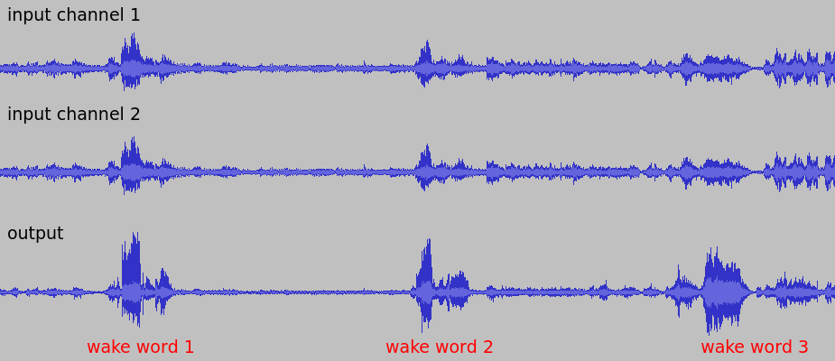
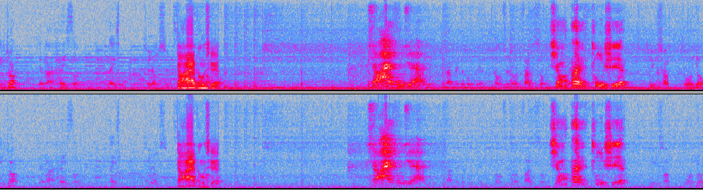

# 降噪例程 [[English]](./README.md)

（参考在上一级的 `examples` 目录下的 [README.md](../README.md) 文件来获取更多信息。）

本示例使用乐鑫麦克风阵列语音增强（mic-array speech enhancement, MASE）算法处理多通道语音信号，输出单通道 16kHz 16bit 信号，并通过耳机输出增强后的信号。通过按下开发板的 "Mode" 按键，用户可控制输出信号是否经过 MASE 算法。

## 如何使用例程

### 准备硬件

* 本示例能够在 ESP32-Korvo 开发板上运行。更多信息请参考 [ESP32-Korvo 用户指南](https://github.com/espressif/esp-skainet/blob/master/docs/esp32-korvo-guide/docs/zh_CN/hw-reference/esp32/user-guide-esp32-korvo-v1.1.md)。

* 耳机。

### 配置工程

* 进入 `make menuconfig`。

* 在 `Serial flasher config` 菜单中设置串口信息。

* 在 `Audio Media HAL` 菜单的 `Audio hardware board` 选项中选择 Korvo，并根据需要选择 `Mic-array type`。

### 编译和烧写

编译并烧写，然后运行终端监控查看打印：

```
make -j4 flash monitor
```

(退出窗口，请键入 ``Ctrl-]``.)

参考 [Getting Started Guide](https://docs.espressif.com/projects/esp-idf/en/stable/get-started-cmake/index.html) 来获取更多使用 ESP-IDF 编译项目的细节.

### MASE 的开启和关闭

命令行的初始打印是：

```
MASE STATE: 1
```

说明 MASE 处于开启状态。按下 "Mode" 按键，MASE 会关闭，且命令行输出：

```
MASE STATE: 0
```

再按下 "Mode" 按键即可重新开启 MASE。

## 例程输出

### 音频流

开发者可以直接通过耳机听到输出音频信号，也可以保存 MASE 前后的音频信号，使用音频分析软件更直观地看到语音增强效果。本例程中 MASE 工作在 `WAKE_UP_ENHANCEMENT_MODE` 模式，即针对唤醒词（及其之后用于本地命令词识别或云端语音识别的语音信号，若有）做了特殊的增强处理。你将会看到类似以下效果，唤醒词得到了明显增强：

* 时域



* 频域



### 语音识别效果的提升

MASE 能够显著提高语音识别效果，包括本地唤醒词识别（WakeNet），本地命令词识别（MultiNet）和云端识别。我们的测试结果显示，5dB 信噪比环境下，和单麦系统相比，2 麦和 3 麦分别能够提升超过 **15%** 和 **20%** 的 WakeNet 性能和超过 **10%** 和 **15%** 的 MultiNet 性能。