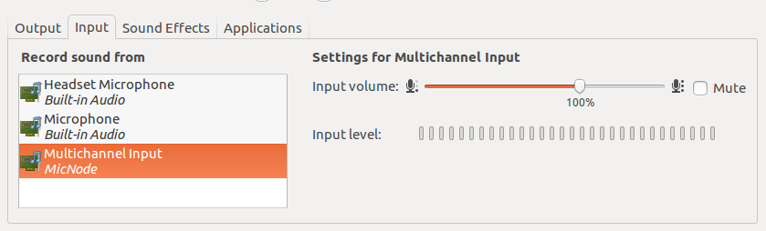

## Overview

This project is to transfer the on-board microphone data to the computer via the USB audio device function.

Supported Development Boards

* ESP-BOX 
* ESP32-S3-Korvo-2: You need to remove the 0-ohm resistors (R181,R182) at USB_DM and USB_DP and add two 0-ohm resistors (R394,R395) at ESP_USB_DM and ESP_USB_DP. [Hardware Schematic](https://dl.espressif.com/dl/schematics/SCH_ESP32-S3-KORVO-2_V3_0_20210918.pdf)

## How To USE

### 1. compile and flash project
```
idf.py set-target esp32s3 
idf.py flash
```

**Note**: After you flash this project, the device will act as a USB sound card. If you want to flash other projects by USB again, Please hold down `Boot` and then press `Reset` to initiates firmware-download-mode.

### 2. select sound card device

When you plug the usb port into your computer(**Linux only**), it will display the MicNode sound card device. Please select MicNode sound card device.   


### 3. Recording by arecord

    ```bash
    # Install arecord
    sudo apt-get install alsa-utils alsa-tools alsa-tools-gui alsamixergui -y

    # Show the list of CAPTURE hardware devices
    arecord -l

    # Start to record
    arecord -Dhw:1,0 -d 60 -f cd -r 16000 -c 2 -t wav voice.wav
    #-D, --device=NAME       select CAPTURE hardware device, hw:1,0 means card 1 and device 0
    #-d, --duration=#        interrupt after # seconds
    #-f, --format=FORMAT     sample format, cd: 16 bit little endian, stereo)
    #-r, --rate=#            sample rate
    #-c, --channels=#        channels
    #-t, --file-type TYPE    file type (voc, wav, raw or au)

    # Print help info
    arecord -h
    ```